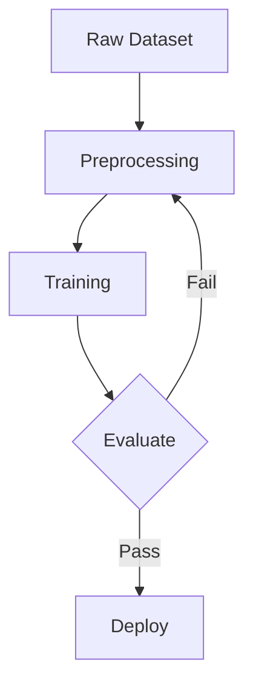
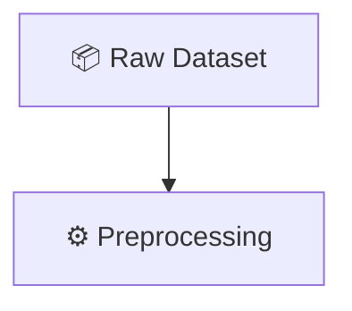

# Blog Post Requirements — Complete Specification

## Core Principles

### Narrative Structure: Problem-First
Every post must follow a clear problem-to-solution arc:
1. **Open with a real problem** that engineers or teams face—not a technology name
2. **Show why it matters**: Connect the problem to a business outcome or engineering constraint
3. **Present a concrete approach**: Walk through a specific solution with examples
4. **End with actionable insight**: Readers should know what to do next

### NO EMOJIS — ANYWHERE
- No emojis in title, excerpt, content, or diagrams
- No emoji shortcodes (`:fire:`, `:rocket:`)
- No unicode symbols as decoration (✓, ✗, ➜, →)
- Use words instead: "important" not ⭐, "key point" not 🔑
- Diagrams must use text labels only, no icons or emoji

---

## Content Structure

### Schema (JavaScript Module)
Each blog post exports an object with:
```javascript
{
  id: number,                    // Unique post identifier (incrementing)
  slug: "kebab-case-title",     // URL-safe slug (30–60 chars)
  title: "Exact Post Title",    // Readable title (50–85 chars)
  category: "project" | "research" | "news",
  iconKey: "PascalCaseIcon",    // Icon identifier from component map
  color: "#HexColor",           // Brand color for post card (7 chars)
  date: "YYYY-MM-DD",           // Publication date (ISO format)
  readTime: "X min",            // Estimated read time (format exactly)
  tags: ["Tag1", "Tag2", ...],  // Topics for filtering (3–7 tags)
  excerpt: "One-line summary",  // Preview text (80–150 characters)
  content: "markdown string",   // Full post content (400–500 words)
  references: [...]             // Harvard-style citations (3–6)
  githubUrl: "optional URL"     // Optional GitHub repository link
}
```

### Field Specifications (Detailed)

#### id (number)
- **Type**: Integer
- **Rules**: Sequential, no gaps, increment by 1
- **Usage**: Stable sorting in blog registry (highest ID first = newest)
- **Examples**: `id: 1`, `id: 9`, `id: 12`

#### slug (string)
- **Length**: 30–60 characters maximum
- **Format**: kebab-case (lowercase letters, hyphens only)
- **Uniqueness**: Must be unique across all posts
- **Filename**: Must match file name exactly (without `.js` extension)
- **Pattern**: `/^[a-z0-9](-?[a-z0-9])*$/`
- **Examples**:
  - ✅ `angular-spa-routing` (29 chars)
  - ✅ `tinyml-face-verification` (24 chars)
  - ✅ `graphrag-vs-lazygraphrag-local-vs-global-rag` (44 chars)
  - ❌ `Angular SPA Routing` (spaces)
  - ❌ `angular_spa_routing` (underscores)
  - ❌ `angular-spa-routing-patterns-comprehensive-guide-for-developers` (too long)

#### title (string)
- **Length**: 50–85 characters (fits one line in blog card UI)
- **Format**: Sentence case with colons/commas, NO emojis
- **Tone**: Problem or technique name; avoid "Exploring", "Understanding", "Introduction to"
- **Capitalization**: Natural capitalization, not ALL CAPS or title-case
- **Examples**:
  - ✅ "Angular SPA Routing: Lazy Loading, Guards & Child Routes" (61 chars)
  - ✅ "TinyML Face Verification on Arduino with LiteRT" (48 chars)
  - ✅ "Python Data Analysis: EDA, Visualisation & Statistical Inference" (65 chars)
  - ✅ "GraphRAG vs LazyGraphRAG: Local vs Global RAG" (45 chars)
  - ❌ "Exploring the Wonders of Machine Learning 🚀" (contains emoji)
  - ❌ "Introduction to Generative AI for Beginners and Advanced Users" (too long, generic)
  - ❌ "MACHINE LEARNING FOR DATA SCIENCE" (all caps)

#### category (string)
- **Allowed Values**: `"project"` | `"research"` | `"news"`
- **Semantics**:
  - `"project"`: Your own implementation, code, system, working example
  - `"research"`: Theoretical exploration, literature review, analysis
  - `"news"`: Industry update, commentary, announcement
- **UI Usage**: Impacts filtering, badge display, card styling

#### iconKey (string)
- **Format**: PascalCase, matches icon component name
- **Location**: Defined in `BlogsList.jsx` icon map (verify before use)
- **Rendering**: Icon displays in post card header (24px), colored by `color` field
- **Available Examples**: `ArrowLeftRight`, `Python`, `Bot`, `Radio`, `ScanSearch`, `Brain`, `Zap`
- **Fail Case**: If iconKey doesn't exist in map, rendering breaks
- **Rules**: Must exist in component or post won't display correctly

#### color (string)
- **Format**: Hex color code (#RRGGBB or #RGB)
- **Length**: 7 characters (e.g., `#3b82f6`) or 4-character shorthand (e.g., `#f59`)
- **Contrast**: Must contrast with white background (lightness ≥ 40% in HSL)
- **Uniqueness**: Reuse acceptable; multiple posts can share colors
- **Theme**: Color should relate thematically to post topic
- **Examples**:
  - ✅ `"#3b82f6"` (blue — frameworks)
  - ✅ `"#ec4899"` (pink — data science)
  - ✅ `"#10b981"` (green — edge AI)
  - ✅ `"#a855f7"` (purple — research)
  - ❌ `"#ffffff"` (no contrast)
  - ❌ `"rgb(100, 150, 200)"` (wrong format)

#### date (string)
- **Format**: ISO 8601 date `"YYYY-MM-DD"` (exactly 10 characters)
- **Validation**: Must be valid calendar date
- **Purpose**: Controls sort order (newest-first)
- **Examples**: `"2026-03-08"`, `"2026-04-15"`
- **Anti-patterns**: `"3/8/2026"`, `"08-Mar-2026"`, `"2026/03/08"`

#### readTime (string)
- **Format**: Exactly `"X min"` (single space, lowercase "min")
- **Estimation**: ~200 words per minute
- **Range**: Typically `"5 min"` to `"15 min"` (rarely exceeds 99)
- **Examples**:
  - ✅ `"5 min"`
  - ✅ `"12 min"`
  - ✅ `"9 min"`
  - ❌ `"5-min read"`
  - ❌ `"5 mins"`
  - ❌ `"~5 min"`

#### tags (array of strings)
- **Count**: Minimum 3, optimal 5–7, maximum 7 tags
- **Format**: Each tag is PascalCase or plain text (no hyphens, no spaces)
- **Length**: Each tag 3–25 characters
- **Purpose**: Enable search/filtering in blog list UI
- **Examples**:
  - ✅ `["Angular", "TypeScript", "RxJS", "Lazy Loading", "SPA", "Router"]`
  - ✅ `["TinyML", "TensorFlow Lite", "PyTorch", "Arduino", "Edge AI"]`
  - ❌ `["ml", "ai"]` (too vague, too short)
  - ❌ `["machine-learning", "data-science"]` (hyphens in tags)
  - ❌ `["Machine Learning", "Data Science"]` (spaces)

#### excerpt (string)
- **Length**: 80–150 characters (one readable sentence)
- **Format**: Complete sentence, ends with period, NO emojis
- **Tone**: Hook reader or summarize core benefit
- **Purpose**: Preview text shown in blog list view
- **Examples**:
  - ✅ "A hands-on Angular 14 project demonstrating client-side SPA routing patterns: feature module lazy loading, route guards, child routes, and RxJS-powered reactive navigation." (153 chars)
  - ✅ "On-device face verification running on an Arduino microcontroller — trained in PyTorch, converted to LiteRT, and deployed as C firmware with no cloud dependency." (161 chars)
  - ✅ "A decision framework for when to use GraphRAG vs LazyGraphRAG vs vector RAG based on query distribution analysis and evaluation."
  - ❌ "This post explores RAG systems." (Too vague, too short)
  - ❌ "Learn about face verification! 🧠" (Contains emoji)
  - ❌ "In this post we discuss..." (No hook)

#### githubUrl (string, optional)
- **Format**: Full `https://` URL, no `http://`
- **Purpose**: Link to project repository if applicable
- **Requirement**: Optional — omit field entirely if no repo
- **Validation**: Must resolve (no 404s)
- **Examples**:
  - ✅ `"https://github.com/Nishan052/barcodeScanner"`
  - ✅ `"https://github.com/Nishan052/SignalDock"`
  - ❌ `"github.com/Nishan052/..."` (missing https://)
  - ❌ `"http://github.com/..."` (wrong protocol)

---

## Content Guidelines (Markdown)

### Length
- **Target**: 400–450 words (fits one A4 page when printed)
- **Absolute maximum**: 500 words (hard limit)
- **Minimum**: 300 words (rare, only for very focused posts)
- **Counting**: Includes headers, diagram labels, table text; excludes code blocks
- **Verification**: `wc -w content.md` to check

### Markdown Format Rules

**Headers**
- Level 2 (`##`) for section names: `## Overview`, `## Architecture`, `## Design Decisions`
- Level 3 (`###`) for subsections: `### Why This Approach?`
- No single # headers (reserved for page titles)
- No header-only sections; each header must have content below it
- Content immediately after header (no blank lines)

**Text Emphasis**
- **Bold** for key concepts on FIRST mention only: `**Retrieval-Augmented Generation**`
- Minimize bold usage: max 3–5 bolded terms per section
- No italic (`*text*`) for general emphasis
- No underline (`__text__`) — renders poorly
- Code words in backticks: `model.fit()`, `.tflite`, `pushState`

**Lists**
- Unordered lists (`-`): Use maximum once per post, for short non-sequential items
  - Example: "On-device deployment means: — zero latency, — privacy, — offline"
  - Each item 1–2 sentences
- Ordered lists (`1.`, `2.`): Use for step-by-step guidance
  - Example: "Pipeline steps: 1. Load data, 2. Create model, 3. Train"
- No nested lists (exceeds scope)
- Consistent punctuation (all items end with period or none)

**Punctuation & Dashes**
- Em-dashes (`—`) for clause breaks, NOT hyphens
  - ❌ "This is false - but this is true"
  - ✅ "This is false — but this is true"
- Hyphens only for compound words: `client-side`, `multi-task`, `end-to-end`
- NO exclamation marks in technical prose (zero exclamations)
- NO semicolons; use periods or em-dashes instead
- Single space after periods (never double space)

**Code & Technical References**
- Inline code for: file paths, function names, keywords, module names
  - Examples: `docker-compose`, `model.h`, `pushState`, `DataFrame`
- File paths: `src/data/blogs/index.js` (in backticks)
- Code blocks use triple backticks with language:
  - ` ```bash` for shell commands
  - ` ```javascript` for JS
  - ` ```python` for Python

**Tables (Optional)**
- Use when comparing 3+ options across 3+ attributes
- Maximum: 1 table per post
- Rows: 3–8 maximum (longer tables are unreadable)
- Example:
```
| Feature | MQTT | REST | WebSocket |
|---------|------|------|-----------|
| Overhead | < 2 bytes | KB+ | Medium |
| Connection | Persistent | Request/response | Persistent |
```

### Diagrams (Mermaid) — Detailed Rules

**Format & Placement**
- Wrap in fenced code blocks: ` ```mermaid ... ``` `
- **Include a text caption below each diagram** explaining its purpose
- Maximum 2 diagrams per post (enhance, don't decorate)
- Diagrams should break up text sections

**NO Emojis or Icons**
- Plain text labels only: `"Load Data"`, `"Model Training"`, `"Deploy"`
- NEVER: `"📦 Load Data"`, `"⚙️ Model Training"`, `"🚀 Deploy"`
- NO unicode symbols: ✓, ✗, ➜, →
- Use text descriptors: `[Success]`, `[Error]`, `[Complete]`

**Diagram Types Allowed**
- `flowchart TD` — top-down processes, pipelines
- `flowchart LR` — left-right data flow, relationships
- `sequenceDiagram` — interactions, timing, message flow
- `stateDiagram-v2` — state machines, status transitions
- **NOT allowed**: Pie charts, bar charts, scatter plots (use text tables instead)

**Example: Correct Diagram**
```


*The above flowchart shows the ML training loop: data enters, passes through preprocessing and training, then evaluates. If performance fails, the loop repeats.*
```

**Example: Incorrect Diagram**
```


(Uses emojis — not allowed.)
```

---

## Writing Style & Tone

**Voice & Tone (Detailed)**
- **Friendly but authoritative**: Like colleague-to-colleague, not classroom lecture
- **Direct**: Lead with the point, not background
- **Human**: Contractions okay ("don't", "it's"), avoid overly casual tone
- **Humble**: Acknowledge limitations, trade-offs, competing approaches
- **Technical but accessible**: Define concepts, don't over-explain obvious terms
- **Active voice**: Target 80%+ active voice

**Tone Examples (Good)**

- "Face verification is a **metric learning** problem, not a classification problem." (Direct, specific)
- "This is cheaper than two separate models and the tasks are positively correlated." (Shows reasoning)
- "Quantisation reduces 4× memory — critical for MCUs with 256 KB RAM." (Concrete benefit)
- "When you deploy serverless on AWS Lambda, cold starts add 2–5 seconds." (Real scenario)

**Tone Examples (Avoid)**

- ❌ "We are excited to present…" (Vague enthusiasm)
- ❌ "Harness the power of machine learning…" (Marketing language)
- ❌ "Arguably the most important concept…" (Unsubstantiated)
- ❌ "This is amazing technology." (No concrete backing)
- ❌ "Machine learning enables innovation at scale." (Buzzword soup)

**Sentence Structure & Rhythm**
- Average sentence: 12–18 words
- Vary length: mix short (5–8 words) + long (20–25 words)
- Avoid rambling multi-clause constructions; use dashes or periods
- ❌ "…which means that because of the fact that…"
- ✅ "This means X happens."

**Language Restrictions (Forbidden Words)**
- **Never use**: passionate, excited, leverage, synergy, dynamic, best-in-class, cutting-edge, game-changer, revolutionary, paradigm shift
- **Minimize**: basically, literally, actually, very, really, quite
- **Avoid passive voice**: Replace 80%+ with active voice
- **No vague adjectives**: "good", "nice", "interesting" (without evidence)
- **No filler**: Trim any sentence that doesn't advance argument
- **No hedging**: "arguably", "I think", "it seems like"

---

## Theme & Color Guidelines

**Color Palette (Post Accent Colors)**
Standard colors for blog post cards:
- **Blue**: `#3b82f6` — Frameworks, Architecture, Systems
- **Pink**: `#ec4899` — Data Science, Analysis
- **Green**: `#10b981` — Edge AI, IoT, Optimization
- **Amber**: `#f59e0b` — Embedded Systems, Performance
- **Purple**: `#a855f7` — Advanced Topics, Research
- **Cyan**: `#06b6d4` — Web, Frontend, APIs
- **Red**: `#ef4444` — Security, Performance Critical

**Color Usage Rules**
- Every post must have exactly one hex color
- Color must contrast with white background (lightness ≥ 40% in HSL)
- Color should relate thematically to topic (not random)
- Reuse acceptable; multiple posts can share colors
- NO grayscale (`#666666`) or invalid hex codes

**Icon Styling**
- Icons display in post card header (24px)
- Icon color derived from `color` field
- Icons are vector components (not emojis)

---

## References (Harvard Style — Detailed)

### Requirements
- **Minimum**: 3 references per post (hard minimum)
- **Maximum**: 6 references per post
- **ALL references MUST be real, published, verifiable sources**
- **No self-references**: Don't cite your own previous posts
- **Test all URLs**: No dead links before publishing

### Reference Format

Standard Harvard with URL:
```
Author(s) (Year) "Title". Publication, Volume(Issue), pp. Page. URL.
```

Array format in code:
```javascript
references: [
  { 
    text: "Smith, J. & Taylor, R. (2024) Machine Learning Fundamentals. Cambridge University Press.",
    url: "https://example.com/book"
  },
  {
    text: "OpenAI (2023) GPT-4 Technical Report.",
    url: "https://arxiv.org/abs/2303.08774"
  }
]
```

### Acceptable Source Types
- Research papers (arXiv, CVPR, NeurIPS, ICML)
- Official documentation (Google, Microsoft, OpenAI, AWS, TensorFlow)
- Published books (O'Reilly, Springer, Cambridge)
- Academic theses (PhD, Master's from recognized institutions)
- Whitepapers (from established companies/labs)
- Conference proceedings (IEEE, ACM, AAAI)
- Standards (ISO, OASIS, W3C, IETF)

### Unacceptable Sources
- ❌ Blog posts without institutional backing
- ❌ Stack Overflow, Reddit threads
- ❌ Wikipedia, crowdsourced content
- ❌ YouTube videos (unless official entity)
- ❌ Dead links or 404 URLs
- ❌ Generic tutorials with no authorship

### Reference Examples (Correct)

✅ Research Paper:
```
Schroff, F., Kalenichenko, D. & Philbin, J. (2015) "FaceNet: Unified Embedding for Face Recognition". CVPR. https://arxiv.org/abs/1503.03832
```

✅ Official Documentation:
```
TensorFlow Team (2024) Post-training Quantization Guide. https://www.tensorflow.org/lite/performance/post_training_quantization
```

✅ Book:
```
Warden, P. & Situnayake, D. (2019) TinyML: Machine Learning with TensorFlow Lite on Arduino. O'Reilly Media.
```

✅ Journal Article:
```
Harris, C.R. et al. (2020) "Array Programming with NumPy". Nature, 585, pp. 357–362. https://doi.org/10.1038/s41586-020-2649-2
```

---

## Quality Gate Before Publishing

Before submitting a post:

1. **Problem Test**: State the core problem in one sentence — is it specific and real?
2. **Concrete Test**: Does the solution include specific examples or diagrams from your work?
3. **Reference Test**: Can you cite a published source for each major technical claim?
4. **Audience Test**: Would a senior engineer in your field find this immediately useful?
5. **Brevity Test**: Remove any sentence that doesn't advance the argument
6. **Tone Test**: Read aloud — does it sound human, direct, authoritative (not robotic)?
7. **Emoji Test**: NO emojis anywhere (title, content, diagrams)?
8. **Field Test**: Verify all field lengths (title < 85, slug < 60, excerpt 80–150, etc.)
9. **Word Count Test**: Use `wc -w` to verify 400–500 words
10. **Link Test**: Test all references and GitHub URLs; no 404s

---

## Common Mistakes to Avoid

### Narrative Mistakes
- ❌ Starting with "Here is a technology…" — START with a problem
- ❌ Listing features without showing impact — CONNECT to outcomes
- ❌ Theoretical examples only — GROUND in real scenarios
- ❌ Ending without next steps — CLOSE with clarity
- ❌ No diagrams in concept-heavy posts — ADD at least one flowchart

### Writing Mistakes
- ❌ Passive voice dominance — USE active voice
- ❌ Multiple exclamation marks — USE zero
- ❌ Undefined jargon — EXPLAIN or avoid
- ❌ Filler sentences — EVERY sentence earns its place
- ❌ Contrived transitions — TRUST reader comprehension

### Technical Mistakes
- ❌ Code without explanation — EXPLAIN each line
- ❌ Cherry-picked benchmarks — CITE sources, show limits
- ❌ Unsupported claims — REFERENCE every major claim
- ❌ Outdated information — VERIFY publication dates
- ❌ Broken links — TEST before publishing

### Formatting Mistakes
- ❌ Emojis anywhere — REMOVE all
- ❌ Title > 85 chars — SHORTEN
- ❌ Slug with numbers/special chars — USE lowercase + hyphens only
- ❌ Excerpt > 150 chars — TRIM
- ❌ readTime not "X min" format — FIX format
- ❌ > 2 diagrams — REDUCE

---

## Example Opening Lines (Good)

- "Most RAG systems fail not because of the model, but because retrieval doesn't match question distribution."
- "When you deploy serverless on AWS Lambda, cold starts add 2–5 seconds to your first API call."
- "I spent three weeks optimizing embeddings and got 10% better recall. Then we changed how we chunked documents and got 40% better."
- "Single Page Applications load once and then update the DOM in response to URL changes — no full-page reloads."
- "Face verification is not a classification problem; it's a metric learning problem."

## Example Opening Lines (Avoid)

- ❌ "The world of AI is rapidly evolving…"
- ❌ "In this blog post, I will explore…"
- ❌ "Machine learning is an exciting field…"
- ❌ "Retrieval-Augmented Generation is a powerful technique…"
- ❌ "Welcome! Today we're diving into…"
